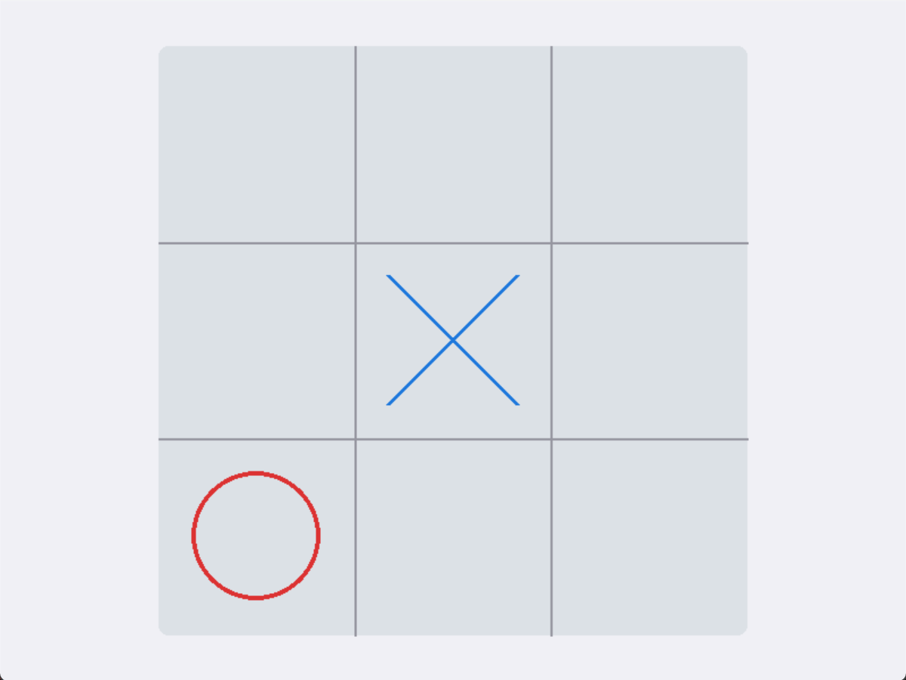
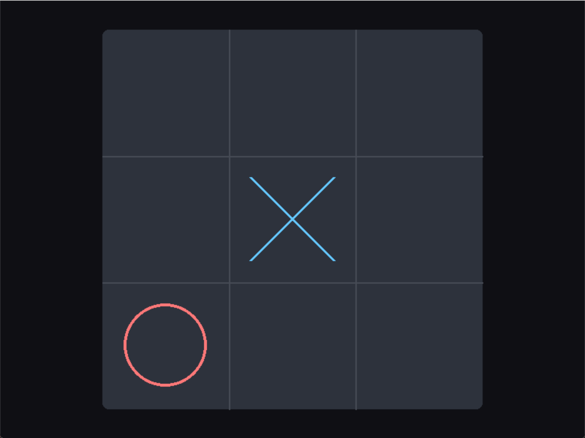
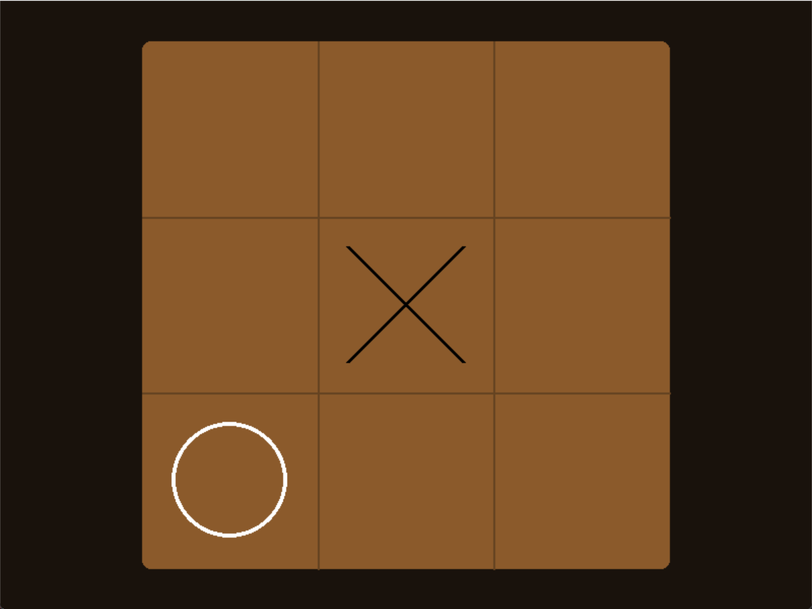
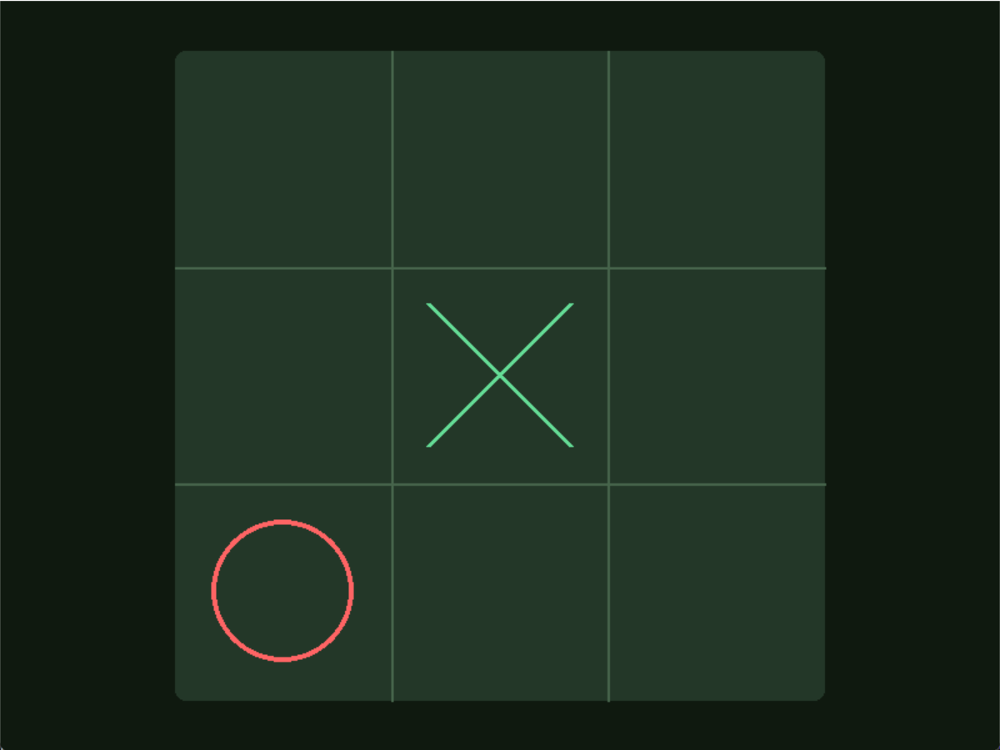
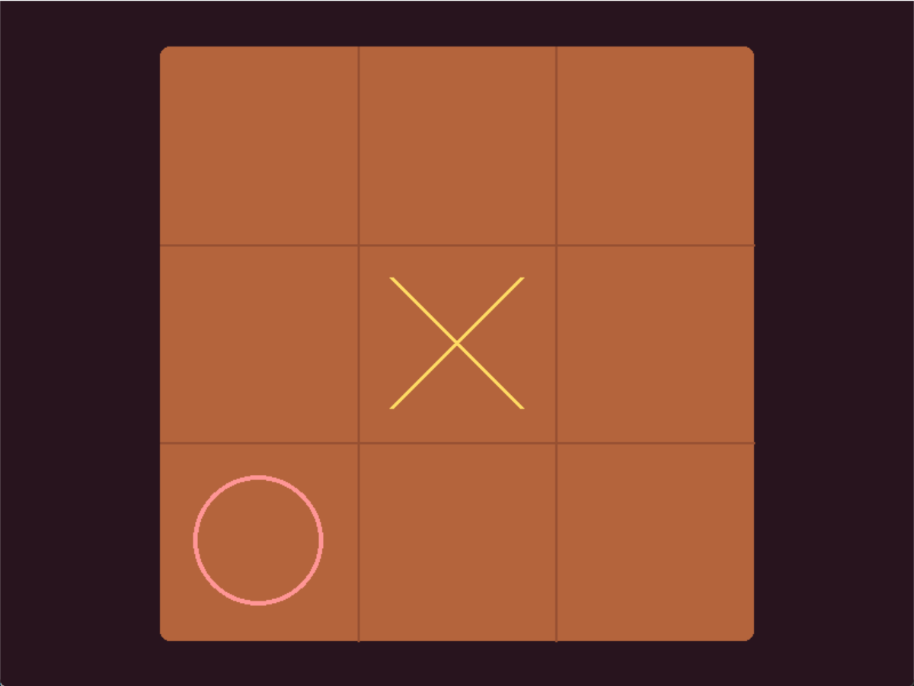

# AlphaZero 通用训练框架

一个可复用的 AlphaZero 通用训练框架，内置多进程自对弈、可视化 UI、模板与示例，支持快速接入新博弈环境并进行训练/评估。

## 效果展示

以下效果为本地训练的几个示例的动态演示，其中训练硬件配置为：

**CPU：Intel i9-13900X**

**GPU：RTX 4070 Laptop**

**RAM：2×8GB**

模型位于**result/models/{name_of_game}/last_model.pth**
可以直接在play.py中进行游戏

### 1. 井字棋

每次搜索的模拟次数：50

自对弈次数：1000

**训练总耗时： 59s**

神经网络直接输出的效果如下：


### 2. 4×4点格棋

每次搜索的模拟次数：80

自对弈次数：3000

**训练总耗时： 31m 23s**

神经网络直接输出的效果如下：


### 3. 五子棋

> 还没训练，看心情更新

## 功能特性

- 通用 AlphaZero 训练流程（自对弈 + 训练 + 评估）
- 多进程自对弈与经验池
- 可视化 UI
- 支持数据增强
- 使用配置文件进行快速配置，降低上手难度
- 统一的游戏/模型接口，便于扩展
- 内置示例：井字棋、五子棋、点格棋
- 模板快速创建新游戏与模型
- **提供快速模型，仅需在配置文件中修改几个参数即可快速得到一个模型进行验证**
  
> 快速模型目前仅保存权重，因此若修改配置参数，后续再导入会出现模型参数不匹配的情况

## 目录概览

- 入口脚本：训练 [train.py](train.py)，对局/演示 [play.py](play.py)
- 核心 MCTS 实现： [core/](core/)
- 游戏接口与抽象： [games/](games/)
- 神经网络模型： [nn_models/](nn_models/)
- 训练流程与自对弈： [training/](training/)
- 工具： [utils/](utils/)
- UI： [ui/](ui/)
- 示例： [examples/](examples/)
- 模板： [template/](template/)
- 配置： [config/](config/)

## 快速开始

1. 安装依赖

根据 [requirements.txt](requirements.txt) 安装依赖。

```bash
pip install -r requirements.txt
```

ps:默认安装的是cpu版本，需要使用cuda的请到官网安装

1. 训练

使用 [train.py](train.py) 启动训练流程。

1. 对局/演示

使用 [play.py](play.py) 进行对局或 UI 演示。

## 训练流程说明

训练由以下关键模块组成：

- 自对弈与数据生成：见 [training/self_play.py](training/self_play.py)
- 神经网络训练器：见[training/nn_trainer.py](training/nn_trainer.py)
- alphazero训练器：见 [training/alphazero_trainer.py](training/alphazero_trainer.py)
- 经验池：见
① [utils/experience_pool.py](utils/experience_pool.py)
② [utils/share_ring_buffer.py](utils/share_ring_buffer.py)
- 数据增强器：见[utils/data_enhancer.py](utils/data_enhancer.py)

整体流程：

1. 使用 MCTS 进行自对弈并产生训练样本
2. 样本进入经验池
3. 训练神经网络
4. 定期更新和保存模型

## UI 与演示

UI 入口在 [ui/app.py](ui/app.py)。棋盘与样式组件见 [ui/board.py](ui/board.py) 与 [ui/theme.py](ui/theme.py)。

示例 UI：

- 井字棋 UI： [examples/tictactoe/ui.py](examples/tictactoe/ui.py)
- 五子棋 UI： [examples/gomoku/ui.py](examples/gomoku/ui.py)
- 点格棋 UI： [examples/dots_and_boxes/ui.py](examples/dots_and_boxes/ui.py)

支持主题配色，支持自定义主题，可在[config/ui.py](config/ui.py)中选择或设置自己的主题，以下是部分主题的预览(除wood外均由ai生成)：

| light | dark | wood |
| --- | --- | --- |
|  |  |  |

|foresr|ocean|sunset|
| --- | --- | --- |
|  |  |  |

### 训练产出

位于result/目录下

1. 经验池：
   后面的数据表示经验池的最大容量
2. 模型权重：
   **current_model.pth**为上一次保存的模型，在训练过程中会定期更新该模型避免突发问题造成的程序终止，导致需要重头训练
   **last_model.pth**为训练结束后保存的最后的模型
3. 优化器状态：
    **current_optim.pth**为上一次保存的优化器状态，与模型是步的，last同理

## 扩展新游戏

本框架提供了游戏，模型和ui的基类，只需参考模板实现几个函数即可快速添加新游戏

- 游戏模板： [template/template_game.py](template/template_game.py)
- 模型模板： [template/template_model.py](template/template_model.py)
- UI 模板： [template/template_ui.py](template/template_ui.py)

在examples/目录下有井字棋，点格棋，五子棋的示例程序

## 贡献

欢迎提交 Issue 或 PR 来完善框架与示例。
